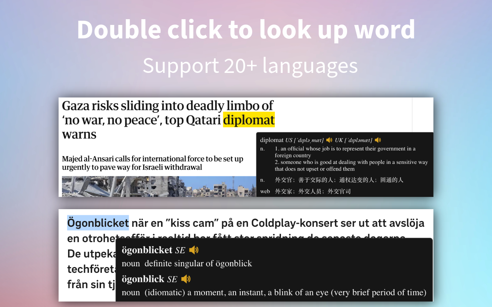
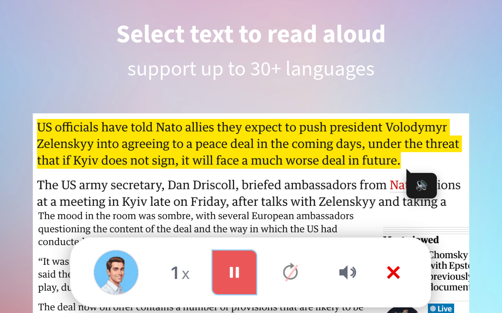
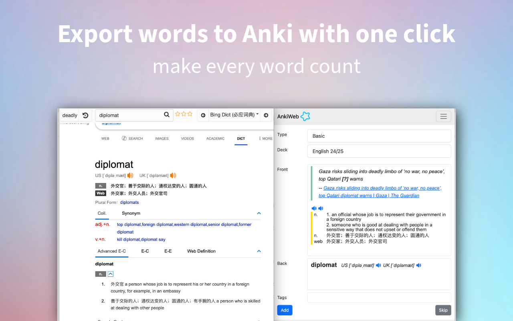

# Dictionariez

A browser extension that helps you look up words in multiple dictionaries. With only one click, you can quickly find the definition, translation, and pronunciation of any word on any webpage, and also export the words you've looked up to **Anki**.

# Install
### Dictionariez download links

- [Dictionariez on Chrome](https://chrome.google.com/webstore/detail/dictionaries/diojcfpekhhnndfmggknljpnfpcccbhc)
- [Dictionariez on Firefox](https://addons.mozilla.org/en-US/firefox/addon/dictionaries/)

- [Dictionariez on Microsoft Edge](https://microsoftedge.microsoft.com/addons/detail/dictionaries-one-to-rule/jdgglojanbnghagoeffacmjodigadoof)

---- 
### Ordböcker download links

**Ordböcker** is an equivalent version of Dictionariez tailored for learning Swedish. It prioritizes Swedish over English and includes a wide range of built-in Swedish dictionaries to support your language learning journey. [Learn more about Ordböcker's featuers and development here](https://pnl.dev/topic/988/ordb%C3%B6cker-the-all-in-one-dictionary-app-for-learning-swedish).

- [Ordböcker on Chrome](https://chromewebstore.google.com/detail/ordb%C3%B6cker-swedish-learnin/mfgjnhlgimobopmfhfnemcgkdmofcmlo)
- [Ordböcker on Microsoft Edge](https://microsoftedge.microsoft.com/addons/detail/ordb%C3%B6cker-swedish-learni/lbghhcchdjnppebeaocohpiiekimdfdb)
- [Ordböcker on Firefox](https://addons.mozilla.org/en-US/firefox/addon/ordb%C3%B6cker/)

----
### SidePal download links

**SidePal** is a lighter version of Dictionariez that works in the browser's side panel. For full features, use Dictionariez. [Learn more about SidePal's featuers and development here](https://pnl.dev/topic/832/sidepal-your-language-and-ai-ally-in-side-panel).

- [SidePal on Chrome](https://chromewebstore.google.com/detail/sidepal-your-language-and/oildocdoabpmedpnpefhccjdjghdggbl)
- [SidePal on Microsoft Edge](https://microsoftedge.microsoft.com/addons/detail/sidepal-your-language-an/amdfamlegedglkigjblhoakieeokbpaj)
- [SidePal on Firefox](https://addons.mozilla.org/en-US/firefox/addon/sidepal/)

- Android: Install [Kiwi] or [Flow] to use Dictionariez on cellphone.

# TL;DR

Welcome to Dictionariez, the language learning extension available on Chrome, Firefox, and Edge, designed to enhance your language learning experience.

With Dictionariez, you can simply double-click on any word to access its definition, which appears on the screen, making it the fastest way to look up words.

Dictionariez offers a wide range of languages support, including English, Chinese, Japanese, Korean, German, Spanish, French, Italian, Portuguese, Swedish, Norwegian, Danish, Russian, and Tajik. If you need support for additional languages, you can request it on our [Programming and Language community].

Another way is to just click on the app's icon to access a popup window with various dictionaries to search through. This feature allows you to explore words in more depth, with additional features such as auto-completion, word history, keyboard shortcuts, and real human pronunciation to enhance your learning experience.

As a language learner myself, I understand the challenges of learning a new language. That's why my goal is to provide a universal tool that enables users to look up any word in any language. We need your feedback and suggestions to improve the app experience.

Join the [Programming and Language community] today! You can also join our [Discord channel] to discuss linguistics, programming, and even participate in virtual language corners. Together, we can build a community that facilitates language learning.

We look forward to hearing from you and helping you achieve your language learning goals with Dictionariez.

# Screenshot

# More dictionaries are needed!

[See here.](https://pnl.dev/topic/52/help-more-dictionaries-are-needed)

# Build

1. use `yarn` or `npm install` to install requirements.
2. `npm start` to start a webpack dev-server, add the `build/` directory in your browser's extension page to load the extension.
3. To build for Firefox, please use the environment variable `BROWSER=Firefox`. So `BROWSER=Firefox npm start` will build a development version of this add-on for Firefox.
4. To build for `Ordböcker`, use the environment variable `PRODUCT=Ordböcker`. So `PRODUCT=Ordböcker npm start` will build a development version Ordböcker for Chrome.
5. `npm run build` to build the release version. The dest path is `build/`. And `BROWSER=Firefox npm run build` to build the Firefox release version.  `PRODUCT=Ordböcker BROWSER=Firefox npm run build` to build `Ordböcker` for Firefox.
6. `./pack.sh` to pack the extension to zip file. For Firefox, use `BROWSER=Firefox ./pack.sh`.

# Privacy Policy

[See here](privacy.md)

# Donate

I used to be a freelancer, and have been employed for several years. But now I am jobless. This project started as a sideline for fun, now I want to see how far it could go. If you find it's useful, please consider to donate, a cup of coffee would be my greatest incentive.  
Thank you.

[kiwi]: https://kiwibrowser.com/
[flow]: https://play.google.com/store/apps/details?id=org.flow.browser
[Programming and Language community]: https://pnl.dev/
[pnl]: https://pnl.dev/
[Discord channel]: https://discord.gg/sazRac4kSa
