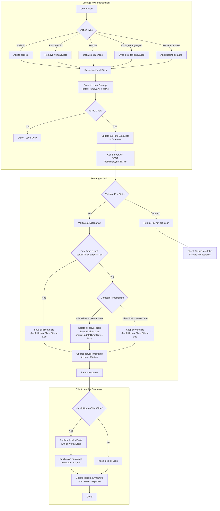
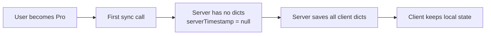
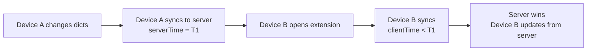
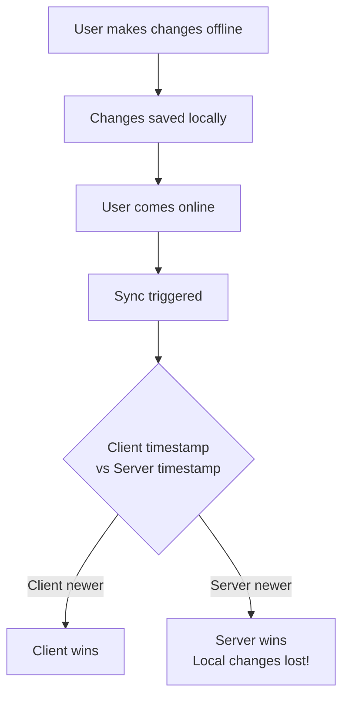
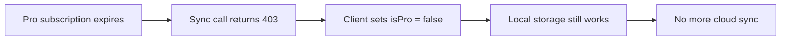
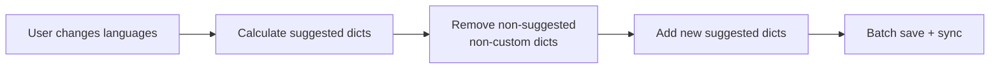
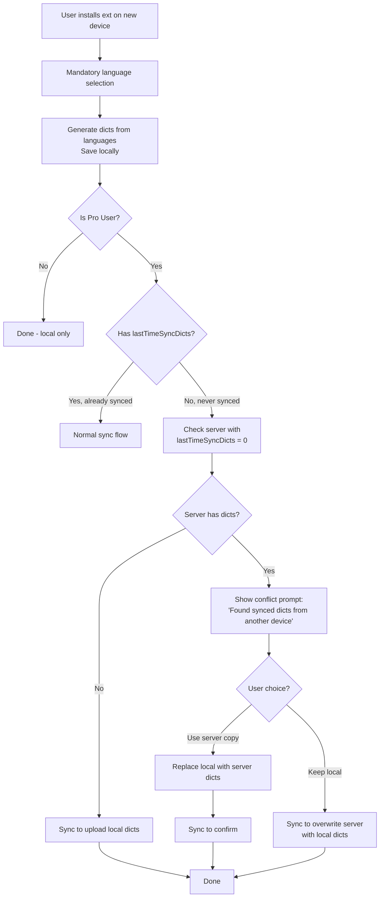

# Dictionary Sync Flow

## Overview

This document describes the synchronization flow between the client (browser extension) and server (pnl.dev cloud) for Pro users' dictionary lists.

## Simplified Sync Model (Proposed)

The sync model is **full state sync** - client always sends complete `allDicts` array, server always overwrites based on timestamp comparison.



## Edge Cases

### Edge Case 1: New Pro User



### Edge Case 2: Multi-Device Sync



### Edge Case 3: Offline Changes



### Edge Case 4: Pro Expires



### Edge Case 5: Language Change



### Edge Case 6: New Device with Existing Server Data



**Key Point**: For Pro users on a fresh install:
1. **Language selection first** (always mandatory)
2. Generate local dicts from selected languages
3. If never synced before, **check server** (with timestamp = 0)
4. If server has data → **ask user**: "Use server copy?" or "Keep local?"
   - Use server copy → replace local dicts with server dicts
   - Keep local → overwrite server with local dicts
5. If server has no data → sync to upload local dicts

Language selection happens **before** the sync check, so server data doesn't affect language choice.

## Data Flow Summary

| Trigger | Local Storage | Cloud Sync |
|---------|--------------|------------|
| Add dict | Append to storage | Full sync |
| Remove dict | Remove from storage | Full sync |
| Reorder | Update all sequences | Full sync |
| Change languages | Batch remove + add | Full sync |
| Open options page | Read only | Full sync (get latest) |

## Key Simplifications

1. **No incremental sync** - Always send full `allDicts` state
2. **Timestamp-based conflict resolution** - Newer timestamp wins
3. **Batch local storage** - Use `removeAll` + `setAll` instead of individual operations
4. **Single sync call** - No separate add/remove actions, just full state sync

## Custom Dict Protection

Custom dicts (installed from pnl.dev with `troveUrl` property) are **never removed** during language sync:

```javascript
// Only remove if: NOT in suggested AND NOT a custom dict
if (!suggestedDictNames.has(dict.dictName) && !dict.troveUrl) {
    remove(dict);
}
```
